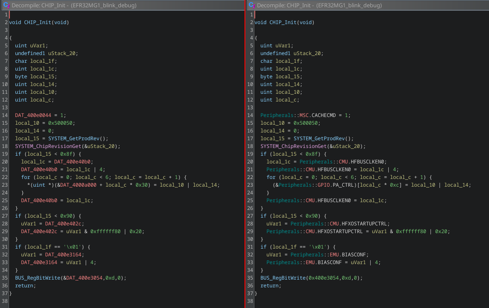

# ARMify Plugin

ARMify is a plugin for the open-source reverse engineering
tool [Ghidra](https://github.com/NationalSecurityAgency/ghidra), with its primary goal being to assist security
analysts in analyzing ARM Cortex-M bare-metal firmware. This is achieved through automatic microcontroller model
identification and annotation of memory-mapped peripherals. It helps analysts to understand how the firmware interacts
with microcontroller features, offering significant time savings compared to manual cross-referencing with the
microcontroller datasheet.

## Screenshots

### MMIO Accesses View

The MMIO Accesses View shows all memory-mapped register addresses accessed by the firmware in the
0x4000_0000–0x5FFF_FFFF range. Users can interactively choose which register addresses to include for device
identification.


---

### Candidate Groups View

The Candidate Groups View displays the set of included register addresses. If a device is selected, the corresponding
register and peripheral names appear in the **Included Register Addresses** table (top). The **Candidate Groups**
table (bottom) lists all groups of compatible devices sharing the same memory map for the currently identified register
accesses. Selecting a group reveals its matching devices on the right.


---

### Decompiled View Comparison

Comparison of the decompiled code before and after applying a device in ARMify.  
**Left:** Vanilla Ghidra output, where peripheral addresses are shown as unnamed symbols (e.g., `DAT_400e40b0`).  
**Right:** After applying a device in ARMify, peripheral addresses are renamed meaningfully (e.g.,
`Peripherals::CMU.HFBUSCLKEN0`), significantly improving code readability.



## Install

1. **Download the ARMify Plugin**

   Download the latest release of the ARMify plugin as a `.zip` file from
   the [Releases](https://github.com/ARMify-Project/ARMify/releases/) page.

2. **Install into Ghidra**

   Open Ghidra and do the following:

    * Go to `File` → `Install Extensions`
    * In the **Install Extensions** dialog, click the **Add extension** icon (green plus symbol) and select the
      downloaded ARMify `.zip` file.
    * Make sure the ARMify extension is checked/enabled.
    * Click **OK** to finish the installation.
    * Restart Ghidra for the changes to take effect.

3. **Enable the ARMify Plugin in CodeBrowser**

   After restarting, open **CodeBrowser**, then:

    * Navigate to `File` → `Configure`
    * In the **Configure Tool** dialog, go to the **Miscellaneous** section and click the **Configure** button
      (see below):

   

    * In the newly opened plugin selection window, find **ARMify Plugin** in the list and check its checkbox to enable
      it
      (see below):

   

    * Click **OK** to confirm.

The ARMify plugin is now active and ready to use within Ghidra. It can be opened in the CodeBrowser via `Window` →
`ARMify Plugin`.

## Build from Source

Java Development Kit (JDK) version 21 or later is required to build this project. To build the ARMify plugin from
source, follow these steps:

1. **Clone the Repository**

   ```bash
   git clone https://github.com/ARMify-Project/ARMify.git
   cd ARMify
   ```

2. **Set the Ghidra Install Directory**

   Create a `gradle.properties` file in the root of the project with the following line:

   ```properties
   GHIDRA_INSTALL_DIR=/path/to/ghidra
   ```

   Replace `/path/to/ghidra` with the full path to your local Ghidra installation (the directory containing `support`,
   `Ghidra`, and `ghidraRun`).

3. **Build the Plugin**

   Run the Gradle build (tested with Gradle 8.14):

   ```bash
   gradle
   ```

   After a successful build, the ZIP archive for the plugin will be created under:

   ```
   dist/
   ```

4. **Install the Plugin**

   Follow the [Install](#install) instructions above to add the ZIP archive to Ghidra.

## Acknowledgement

This project was made possible with funding from [NGI Zero Entrust Fund](https://nlnet.nl/thema/NGI0Entrust.html). NGI
Zero Entrust Fund is part of the European Commission's [Next Generation Internet](https://www.ngi.eu/) initiative.

Project webpage: https://nlnet.nl/project/ARMify/

---

The apply functionality (code
in [DeviceApplyService.java](/main/src/main/java/armify/services/DeviceApplyService.java))
is based
on [SVD-Loader-Ghidra](https://github.com/leveldown-security/SVD-Loader-Ghidra).