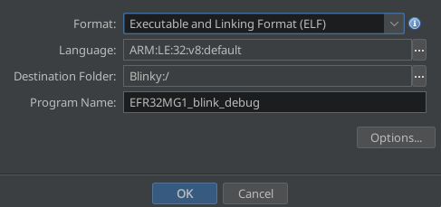
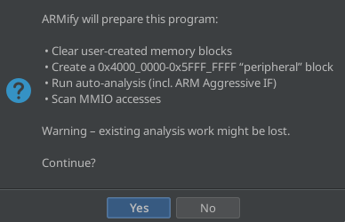
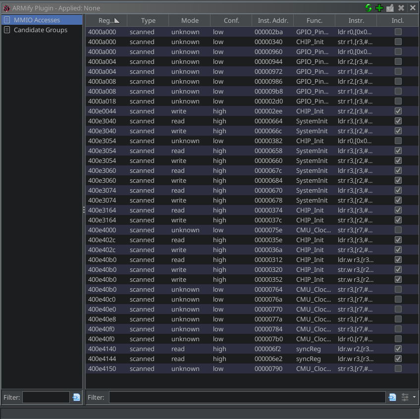
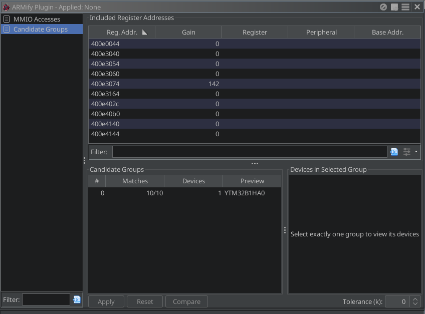
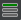
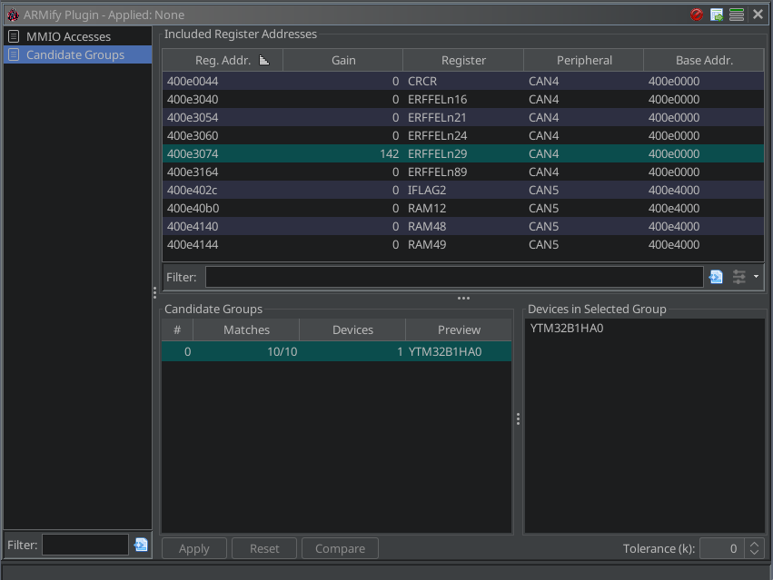
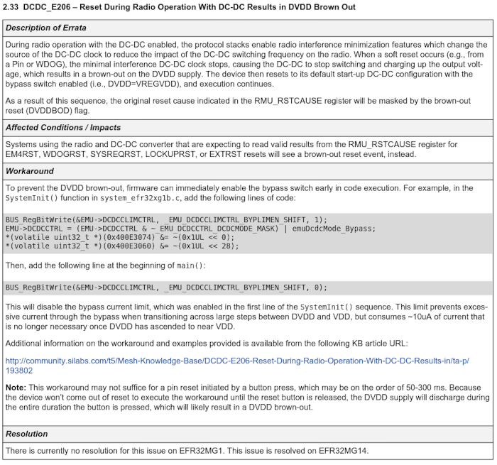
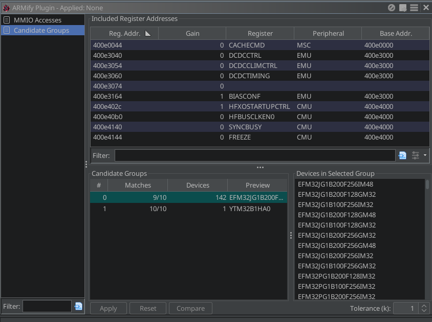
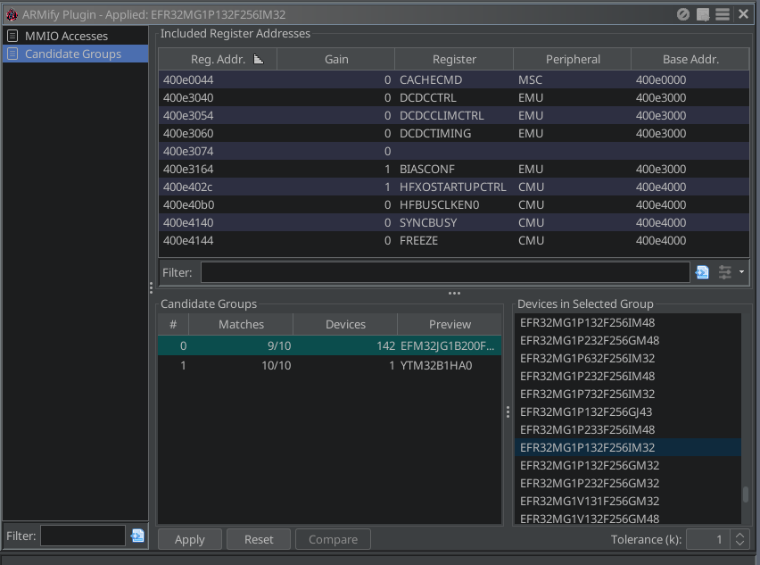

# Basic Tutorial – EFR32MG1 Blink

## Source

This firmware is built from the public repository [lzptr/efr32\_base](https://github.com/lzptr/efr32_base).
Starting from the repository’s default branch, the following patch was applied to `CMakeLists.txt` to target an EFR32
MG1 device and a locally installed GNU ARM toolchain:

```diff
@@
-    set( ARM_TOOLCHAIN_PATH /opt/toolchain/gcc-arm-none-eabi-10.3-2021.10/ )
+    set( ARM_TOOLCHAIN_PATH /usr/ )
@@
-    set(EFR32_DEVICE EFR32MG12P332F1024GL125)  # Sets device / used to locate HAL files
+    set(EFR32_DEVICE EFR32MG1P132F256GM32)     # Sets device / used to locate HAL files
     set(BOARD BRD4166A)                     # Thunderboard Sense 2
```

To build the firmware, follow the instructions in the [lzptr/efr32\_base](https://github.com/lzptr/efr32_base)
repository.

For convenience, the pre-build binary is available here: [EFR32MG1_blink_debug](EFR32MG1_blink_debug)

## Tutorial

- Start Ghidra and create the new non-shared project "Blinky" (`File` → `New Project...`)
- Import the ELF file `EFR32MG1_blink_debug` (`File` → `Import File...`) with the default settings as shown below:

  

- Open the binary in CodeBrowser (double-click) and click `No` on the `Analyze?` dialog
- Open the ARMify plugin via `Window` → `ARMify Plugin` and click `Yes` on the `ARMify initialisation` dialog:

  

- After a short initialization, ARMify is opened in the **MMIO Accesses** view:

  

    - The **MMIO Accesses** view lists every memory-mapped register address referenced by the firmware
      in the 0x4000 0000–0x5FFF FFFF range, presented in a sortable table.
    - **Register Address** – Displays the absolute address of the register.  
      Click the value to jump the Listing view (disassembly) directly to that address.
    - **Type** – Distinguishes between **scanned** entries (automatically identified by ARMify during
      initialization or when using the *Refresh* button ) and **custom**
      entries (manually added via the *Add* button ). To delete unnecessary
      entries—regardless of whether they are scanned or custom, select one or more rows (using Ctrl + Left-click) and
      click the *Delete* button  (be aware that this action is permanent
      and cannot be undone). Custom entries can also be modified by selecting them and clicking the *Edit*
      button . Details on using and managing custom entries are covered in the
      [Advanced Tutorial](../STM32F446/README.md).
    - **Mode** – Shows whether the access was identified as **read**, **write**, or **unknown** operation.
    - **Confidence** – Indicates how certain ARMify is that the address is truly accessed (*high* or *low*).
      By default, only high-confidence addresses are marked as *included*.
    - **Instruction Address** – The exact instruction that performs the access.
      Clicking it focuses the Listing view at that location.
    - **Function** – The function containing the Instruction Address, or "\<GLOBAL\>" if the
      instruction is not part of any defined function.
    - **Include** – A checkbox that controls whether this register address is considered when
      searching for *Candidate Groups*.

- Don't make any changes in the **MMIO Accesses** view and switch to the **Candidate Groups** view:

  

    - The **Candidate Groups** view displays the set of included register addresses in the
      **Included Register Addresses** table (top). The **Candidate Groups** table (bottom) lists all groups of
      compatible devices sharing the same memory map for the currently identified register accesses. Selecting a group
      reveals its matching devices on
      the right.
    - **Included Register Addresses** table (top):
        - **Register Address** – The set of *unique* included addresses (one entry per address, unlike the per-access
          list in the **MMIO Accesses** view). When exactly one row is selected you can jump back to a filtered
          **MMIO Accesses** table that shows only entries with that register address by
          clicking .
        - **Gain** – How many *additional* devices would appear in the Candidate Groups list if this address were
          *excluded*. With a single row selected you can exclude the register address via
          , which unchecks (excludes) all corresponding entries in
          **MMIO Accesses**.
        - **Register**, **Peripheral**, **Base Address** – Once you pick a candidate group,
          these columns are filled with the register name, peripheral name, and base address
          for each in the group contained address. With a single row selected you can inspect the register’s bit-field
          layout by pressing .

    - **Candidate Groups** table (bottom):
        - **#** – Row index
        - **Matches** – “Matched / Total” register addresses for this group
        - **Devices** – Number of devices in the group
        - **Preview** – Up to three representative device names

    - Bottom buttons & **Tolerance** setting:
        - **Apply** – Enabled when exactly one *device* is selected within a candidate group (Ctrl + Left-click again to
          clear the selection). Applies the device: ARMify annotates all memory-mapped peripherals in the
          Listing (disassembly) and Decompiler views.
        - **Reset** – Removes any annotations previously added with **Apply**.
        - **Compare** – Compares the register field layouts of two candidate groups. Select exactly two rows in the
          **Candidate Groups** table before clicking.
        - **Tolerance (k)** – `k = 0` keeps only exact matches; higher values allow up to k mismatched register
          addresses, broadening the list of candidate devices.
- Without any input from our side, ARMify has identified exactly one possible candidate group for the included register
  accesses. If we select this candidate group, the **Included Register Addresses** table is updated by register names,
  peripheral names, and base addresses:

  

- The currently selected candidate group contains only the device `YTM32B1HA0` and identifies the register accesses as
  reads and writes from/to `CAN4` and `CAN5` peripheral. It's obvious that this does not make any sense and therefore
  one or some included register addresses must be wrong. We have two options now:
    - Option A: Excluding the register address `400e3074` would add 142 possible devices. To do this, select the
      address (as shown in the screenshot above), then click the .
    - Option B: Set **Tolerance (k)** to `1` to allow one mismatch.
    - Side Note: The register address `400e3074` is not documented in the datasheet of the `EFR32MG1`
      microcontroller and therefore not included in ARMify's device database. However, there exists
      an [Errata](https://www.silabs.com/documents/public/errata/efr32mg1-errata.pdf), which contains a memory-write to
      `400e3074` (undocumented register):

  

- We go with Option B and select the new appeared candidate group. This time, the register names, peripheral names and
  base addresses make sense and we have identified the correct candidate group. Be aware, that all the devices in this
  group have the same registers and fields layout for the included register addresses. The devices in the group might
  have a different layouts for other register addresses:

  

- We can now apply the device. As noted earlier, for the current set of included register addresses, it doesn't matter
  which device from the selected group is applied. They all share the same memory map. For this tutorial, we’ll apply
  `EFR32MG1P132F256GM32` to demonstrate that the correct device has been identified.
  In the top line of the following screenshot, you’ll see that “**Applied: None**” has changed to “**Applied:
  EFR32MG1P132F256GM32**”:

  

- Comparison of the decompiled code before and after applying the device in ARMify:

  

That concludes the basic usage of ARMify. For additional features, such as adding and refining custom register entries,
interpreting candidate group results, and applying devices, please continue with
the [Advanced Tutorial](../STM32F446/README.md).