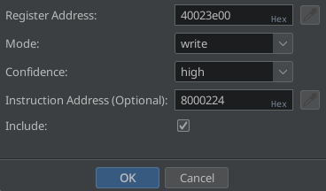

# Advanced Tutorial – STM32F446 Blink

## Source

This firmware is the one used by Thomas Roth ([stacksmashing](https://stacksmashing.net/)) in his YouTube
video [Bare-metal ARM firmware reverse
engineering with Ghidra and SVD-Loader](https://www.youtube.com/watch?v=q4CxE5P6RUE).
The binary is originally available at [ghidraninja/arm-bare-metal-1](https://github.com/ghidraninja/arm-bare-metal-1),
but is included in this repository for convenience: [blink.bin](blink.bin)

## Tutorial

- Start Ghidra and create a new non-shared project "Blinky" (`File` → `New Project...`)
- Import the ELF file `blink.bin` (`File` → `Import File...`) with `ARM:LE:32:Cortex:default` as *Language*. Keep the
  remaining settings as their default:

  

- Open the binary in CodeBrowser (double-click) and click `No` in the `Analyze?` dialog
- Open the ARMify plugin via `Window` → `ARMify Plugin` and click `Yes` in the `ARMify initialization` dialog:

  

- After a short initialization, ARMify is opened in the **MMIO Accesses** view:

  

- A quick look into the **Candidate Groups** view reveals that ARMify found only two register accesses, resulting in 94
  possible candidate groups — far too many. We need to narrow down the candidates by manually adding register accesses.

  

- Switch back to the **MMIO Accesses** view. ARMify identified the register accesses `40020000`, `40020014` (twice), and
  `40023800` (twice), but only the first two with a high **Confidence**. Let us check out why ARMify identified
  `40023800` with a low **Confidence**. To do so, click on the **Instruction Address** `0800232` or `080023a`. The
  cursor in the **Listing** (disassembly) jumps to this address in function `FUN_08000224`. Let's have a look at the
  decompiled code:

  

- As you can see, there is a memory-write to the register address `40023800 + param1` and `param1` is passed to the
  function. In the decompile window, right-click the `FUN_08000224` function name and select `References` →
  `Find References to FUN_08000224`:

  

- There are three references, all from `FUN_08000224`. Click on any of the three entries to jump to the function:

  

- In function `FUN_080001ac` function `FUN_08000224` is called three times with the values `0x600`, `0x603`, and
  `0x811`. Therefore, we can calculate the memory write in `FUN_08000224`:
    - `40023800 + param1` = `40023800 + (0x600 >> 5)` = `40023800 + 0x30` = `40023830`
    - `40023800 + param1` = `40023800 + (0x603 >> 5)` = `40023800 + 0x30` = `40023830`
    - `40023800 + param1` = `40023800 + (0x811 >> 5)` = `40023800 + 0x40` = `40023840`
- Let us now delete the wrongly identified register access `40023800`: In ARMify's **MMIO Accesses** view, select the
  two entries with the **Register Address** `40023800` (press Ctrl + Left-click to select multiple entries) and click
  the delete icon . Confirm the `Delete Entries from Table` dialog.
- Now we are going to add the above calculated addresses `40023830` and `40023840`: Click the add
  button  and enter the following values in the dialog. Since there is no concrete
  **Instruction Address** we could either leave it empty or we can enter the first instruction address of function
  `FUN_08000224` to be able to jump to the function from the table in the **MMIO Accesses** view. For convenience, you
  can select the beginning of the function in the **Listing** (disassembly) window and press the pipette
  button  to copy the address into the textbox:

  

- Do the same for the address `40023840`
- The **MMIO Accesses** view table should look like this afterward:

  

- Check out the **Candidate Groups** view. By simply adding `40023830` and `40023840`, we reduced the number of
  candidate groups from 94 to 16.
- Step through the candidate groups (select index 0, then 1 and so on) and inspect the identified register and
  peripheral names in the table at the top of the **Candidate Groups** view. You may recognize that for all groups,
  except the sixth group (`xmc7100, xmc7200, tviic2d6m`), the addresses `40020000` and `40020014` are identified as
  peripheral `GPIOA` and addresses `40023830` and `40023840` are identified as peripheral `RCC` (Reset & Clock
  Control), `RCM` (Reset & Clock Management), or `RCU` (Reset & Clock Unit).
- A closer look at `FUN_080001ac` and `FUN_08000224` shows that they set bits `0` and `3` of register `0x40023830`, and
  bit `17` of register `0x40023840`:
  ```
  *0x40023830 |= (1 << 0) | (1 << 3);  // 0x600 and 0x603
  *0x40023840 |= (1 << 17);            // 0x811
  ```
- In the **Candidate Groups** view, select the sixth candidate group (`xmc7100, xmc7200, tviic2d6m`) and afterward
  select the register address `40023840` in the register address table at the top. Press the view fields
  information  button and inspect the register layout. As
  you can see, the `SL_ADDR` register has the `ADDR30` field with MSB `32` and LSB `2`. Therefore, this candidate group
  is a false positive and can be ignored:

  

- All other candidate groups have the same layout for our four register addresses (`40020000`, `40020014`, `40023830`,
  and `40023840`). We can check this either with the **Compare** functionality or view the fields information next to
  each other:
    - **Compare** functionality:
      Select the group with index `0` (`STM32F765, STM32F779, STM32F768, ...`) and (press Ctrl + Left-click to select
      multiple entries) with index `13` (`STM32F446`) and press the **Compare** button. A new dialog informs you that
      the layouts in registers `40023830` and `40023840` differ. You can select one of the entries in the table and get
      a detailed explanation about the differences:

      

    - View fields information next to each other: First select the group with index `0` (
      `STM32F765, STM32F779, STM32F768, ...`) and press the view fields
      information  button for register `40023830`. Keep
      the newly opened dialog open and do the same for the group with index `13` (`STM32F446`). You now can compare the
      fields of the two groups next to each other. The `STM32F765, STM32F779, STM32F768, ...` has more GPIO ports, but
      for both groups, the fields `GPIOAEN` and `GPIODEN` are the same:

      

- Normally, you now would have to analyze the field layout of all candidate groups to identify the appropriate groups.
  Since we know that the `STM32F446` device is the right one, we can select it and press the **Apply** button.
- Now that we've applied the `STM32F446` device, let's analyze `FUN_080001cc`. ARMify identified
  writes to the register addresses `40020000` and `40020014` in this function. However, we can't see them in the
  decompiled code:

  

- Double-click on `DAT_08000218` in the **Decompile** view. The **Listing** (disassembly) jumps to the address
  `08000218`. The data type is currently identified as `undefined4`. We can change it to `pointer` by right-click and
  selecting `Data` → `pointer` or by simply pressing `p`. Do the same for `DAT_0800021c`. Afterward, the decompiled code
  should look like this:

  

That concludes the advanced usage of ARMify.